# Luxury Hotel Chain - Snowflake Intelligence Demo

This project demonstrates Snowflake Intelligence capabilities for the hospitality industry, specifically designed for a luxury hotel chain. The demo focuses on three core data sources: **Property Management System (PMS)**, **Point of Sale (POS)**, and **Customer Relationship Management (CRM)**.

## Key Components

### 1. Data Infrastructure
- **Simplified Schema Design**: 7 dimension tables and 5 fact tables covering hotel operations
- **Three Core Data Sources**: PMS (reservations), POS (transactions), and CRM (guest relationships)
- **Realistic Hotel Data**: Sample data representing a luxury hotel chain with 8 properties
- **Database**: `LUXURY_HOTEL_AI_DEMO` with schema `HOTEL_SCHEMA`
- **Warehouse**: `Luxury_Hotel_demo_wh` (XSMALL with auto-suspend/resume)

### 2. Three Business Domain Semantic Views
- **PMS Semantic View**: Reservations, guest profiles, room types, rates, and property data
- **POS Semantic View**: Restaurant, bar, spa, and service transactions across all properties
- **CRM Semantic View**: Marketing campaigns, guest satisfaction, preferences, and loyalty data

### 3. Snowflake Intelligence Agent
- **Hospitality-Focused Agent**: Understands hotel industry terminology and metrics
- **Cross-Domain Analysis**: Can analyze data across PMS, POS, and CRM systems
- **Hotel KPI Support**: Calculates ADR, RevPAR, occupancy rates, and guest satisfaction metrics
- **Natural Language Interface**: Responds to hotel operations questions using industry terminology

## Hotel Chain Architecture

The following diagram shows the three main data sources and their relationships:

```mermaid
graph TD
    subgraph "LUXURY HOTEL CHAIN DATA SOURCES"
        subgraph "Property Management System (PMS)"
            PMS1[Guest Reservations<br/>- Reservation ID<br/>- Guest Profile<br/>- Room Assignments<br/>- Check-in/out dates<br/>- Rate codes]
            PMS2[Room Operations<br/>- Room types<br/>- Occupancy status<br/>- Housekeeping<br/>- Maintenance]
            PMS3[Guest Services<br/>- Concierge requests<br/>- Special services<br/>- Complaints/feedback]
        end
        
        subgraph "Point of Sale (POS)"
            POS1[Restaurant Sales<br/>- Transaction details<br/>- Menu items<br/>- Server assignments<br/>- Table numbers]
            POS2[Bar/Lounge Sales<br/>- Beverage orders<br/>- Happy hour pricing<br/>- Event sales]
            POS3[Spa & Recreation<br/>- Spa treatments<br/>- Fitness classes<br/>- Pool services]
            POS4[Hotel Services<br/>- Room service<br/>- Laundry<br/>- Business center]
        end
        
        subgraph "Customer Relationship Management (CRM)"
            CRM1[Guest Profiles<br/>- Personal information<br/>- Preferences<br/>- Loyalty status<br/>- Communication history]
            CRM2[Marketing Campaigns<br/>- Email campaigns<br/>- Promotional offers<br/>- Seasonal packages]
            CRM3[Guest Satisfaction<br/>- Survey responses<br/>- Review scores<br/>- Complaint resolution]
        end
    end
    
    subgraph "HOTEL ANALYTICS"
        ANALYTICS1[Revenue Management<br/>- ADR Average Daily Rate<br/>- RevPAR Revenue per Available Room<br/>- Occupancy rates]
        ANALYTICS2[Guest Experience<br/>- Service quality metrics<br/>- Satisfaction scores<br/>- Loyalty program performance]
        ANALYTICS3[Operational Efficiency<br/>- Staff productivity<br/>- Service delivery times<br/>- Cost per occupied room]
    end
    
    PMS1 --> ANALYTICS1
    PMS2 --> ANALYTICS3
    PMS3 --> ANALYTICS2
    POS1 --> ANALYTICS1
    POS2 --> ANALYTICS1
    POS3 --> ANALYTICS1
    POS4 --> ANALYTICS3
    CRM1 --> ANALYTICS2
    CRM2 --> ANALYTICS1
    CRM3 --> ANALYTICS2
    
    classDef pmsStyle fill:#e3f2fd
    classDef posStyle fill:#e8f5e8
    classDef crmStyle fill:#fff3e0
    classDef analyticsStyle fill:#fce4ec
    
    class PMS1,PMS2,PMS3 pmsStyle
    class POS1,POS2,POS3,POS4 posStyle
    class CRM1,CRM2,CRM3 crmStyle
    class ANALYTICS1,ANALYTICS2,ANALYTICS3 analyticsStyle
```



## Database Schema

### Dimension Tables (7)
- `property_dim` - Hotel properties in the chain (8 luxury hotels)
- `room_type_dim` - Room categories from Standard to Presidential Suite
- `guest_dim` - Guest profiles with loyalty tier information
- `rate_code_dim` - Rate codes and discount structures
- `service_category_dim` - Service categories (F&B, Wellness, Guest Services)
- `menu_item_dim` - Menu items and service offerings
- `campaign_dim` - Marketing campaigns and promotions

### Fact Tables (5)
- `reservations_fact` - Hotel reservations and booking data (PMS)
- `pos_transactions_fact` - Point of sale transactions across all services (POS)
- `guest_preferences_fact` - Guest preferences and special requests (CRM)
- `marketing_campaigns_fact` - Marketing campaign performance and ROI (CRM)
- `guest_satisfaction_fact` - Guest satisfaction surveys and ratings (CRM)

## Setup Instructions

**Single Script Setup**: The entire hotel demo environment is created with one script:

1. **Run the complete setup script**:
   ```sql
   -- Execute in Snowflake worksheet
   /sql_scripts/hotel_demo_setup.sql
   ```

2. **Upload sample data**:
   - Upload all CSV files from `/demo_data/` to the `@HOTEL_DATA_STAGE` stage
   - Uncomment and run the COPY INTO statements in the setup script

3. **What the script creates**:
   - `Luxury_Hotel_Demo` role and permissions
   - `Luxury_Hotel_demo_wh` warehouse
   - `LUXURY_HOTEL_AI_DEMO.HOTEL_SCHEMA` database and schema
   - All dimension and fact tables with hotel-specific structure
   - 3 semantic views for Cortex Analyst (PMS, POS, CRM)
   - Internal stage for data loading

4. **Post-Setup Verification**:
   - Run `SHOW TABLES;` to verify 12 tables created (7 dimension + 5 fact)
   - Run `SHOW SEMANTIC VIEWS;` to verify 3 semantic views
   - Check table row counts with the verification query in the script

## Agent Capabilities

The Luxury Hotel Intelligence Agent can:
- **Analyze reservation patterns** and booking trends across properties
- **Calculate hotel KPIs** including ADR (Average Daily Rate), RevPAR, and occupancy rates
- **Track guest satisfaction** across all touchpoints and services
- **Measure marketing campaign effectiveness** and guest acquisition costs
- **Analyze F&B and service revenue** by property and service category
- **Monitor guest preferences** and loyalty program performance
- **Generate hospitality insights** using industry-standard terminology and metrics

## Demo Script: Hotel Operations Analysis

The following questions demonstrate the agent's ability to analyze hotel operations across all three data sources:

### 🏨 Property Management & Revenue Analysis
1. **Revenue Performance**  
   "What is our revenue by property for 2025? Show me the ADR and occupancy rates for each hotel."

2. **Booking Patterns**  
   "Which room types generate the highest revenue? Show me booking trends by month."

3. **Rate Code Effectiveness**  
   "How effective are our different rate codes? Which promotional rates drive the most bookings?"

### 🍽️ Point of Sale & Service Revenue
1. **F&B Revenue Analysis**  
   "Show me restaurant and bar revenue by property. Which services are most profitable?"

2. **Spa & Wellness Performance**  
   "What is the revenue from spa services across all properties? Show me popular treatments."

3. **Service Category Trends**  
   "Compare revenue trends across different service categories. Which departments are growing fastest?"

### 👥 Guest Experience & CRM Analytics
1. **Guest Satisfaction Analysis**  
   "What are our average satisfaction scores by property? Which areas need improvement?"

2. **Marketing Campaign ROI**  
   "Which marketing campaigns generated the most bookings and revenue? Show me ROI by campaign type."

3. **Loyalty Program Performance**  
   "How do our loyalty program tiers perform? What's the revenue difference between membership levels?"

### 🔄 Cross-Domain Integration
1. **Guest Journey Analysis**  
   "Show me the complete guest journey from booking to checkout, including all service usage and satisfaction."

2. **Revenue per Guest**  
   "Calculate total revenue per guest including room, F&B, and other services. Which guests are most valuable?"

3. **Operational Efficiency**  
   "Compare operational performance across properties. Which hotels have the best guest satisfaction and revenue per room?"

## Hotel Industry KPIs

The demo supports calculation of standard hotel industry metrics:

- **ADR (Average Daily Rate)**: Average room revenue per occupied room
- **RevPAR (Revenue per Available Room)**: Room revenue divided by total available rooms
- **Occupancy Rate**: Percentage of rooms occupied
- **Guest Satisfaction Score**: Average ratings across all touchpoints
- **Service Revenue per Guest**: Non-room revenue per guest stay
- **Campaign Conversion Rate**: Marketing campaign booking conversion
- **Loyalty Program Penetration**: Percentage of guests in loyalty programs

## Sample Data Overview

- **8 Luxury Hotel Properties** across major US cities
- **8 Room Types** from Standard to Presidential Suite
- **10 Guest Profiles** with varying loyalty tiers
- **18 Menu Items** across restaurants, bars, and spa services
- **15 Reservations** with realistic booking patterns
- **20 POS Transactions** across all service categories
- **15 Guest Satisfaction Surveys** with detailed ratings
- **15 Marketing Campaign Interactions** with conversion tracking

## Next Steps

After setup completion:
1. **Upload the provided CSV files** to your Snowflake stage
2. **Create Cortex Search services** for hotel policy and procedure documents
3. **Configure the Snowflake Intelligence Agent** with the three semantic views
4. **Test with sample questions** to explore hotel operations insights

This simplified demo provides a focused view of how Snowflake Intelligence can transform hotel operations through integrated data analysis across PMS, POS, and CRM systems.
